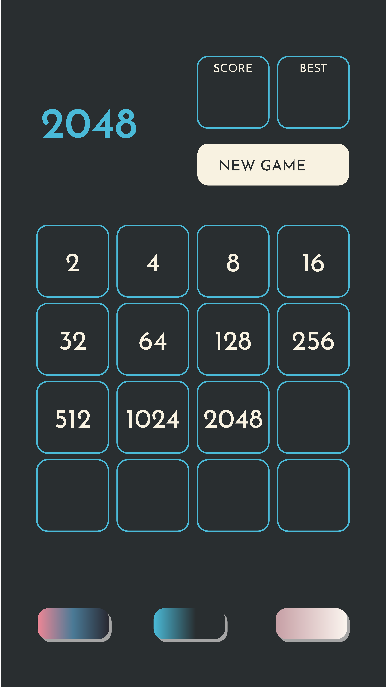
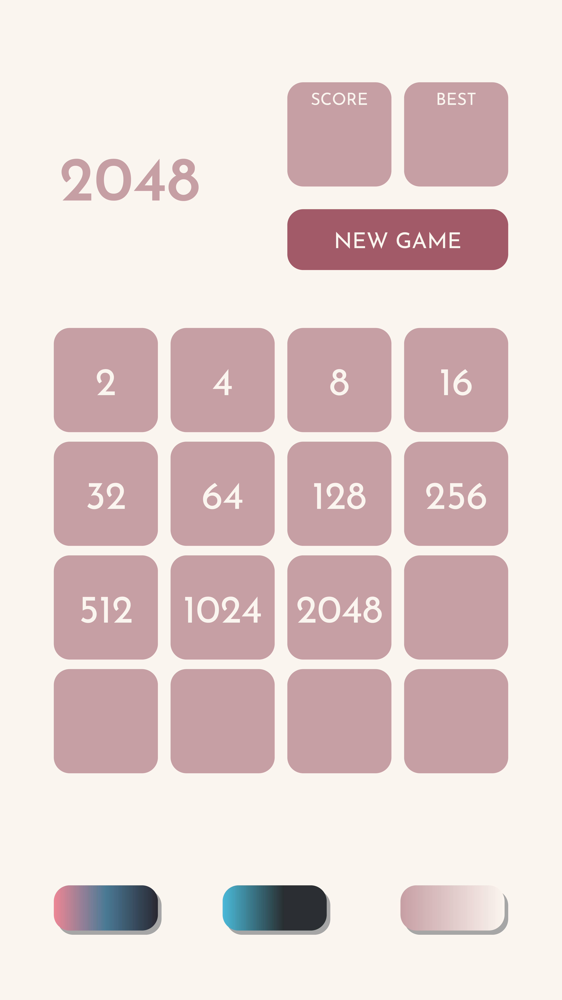
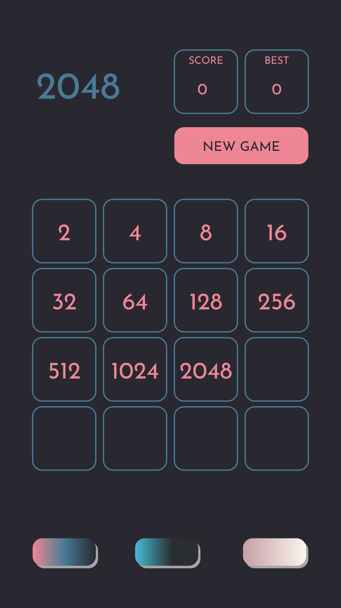

# Projeto: Jogo 2048

## Objetivo

  Será implementado um aplicativo móvel para Android “clonando” o famoso jogo 2048.

## Requisitos 

### 1. Baixe e jogue 2048. Seu jogo deverá ser o mais fiel possível ao original
  Concluído
### 2. A parte visual pode ser feita utilizando qualquer componente disponível no Android Studio. Podem ser utilizadas imagens também, se desejado. A definição de quais componentes e como o layout será construído será realizada pelos alunos.
  Concluído
### 3. O jogo deve apresentar pontuação, gravar score máximo obtido e exibí-lo nos próximos jogos.
  Concluído
### 4. Deve ser possível voltar uma jogada (Undo)
  Concluído
### 5. Não é necessário realizar animação dos quadrados, como existente no jogo original. Mas, se feita, melhora a nota.
  (Opcional)Não Realizado
### 6. Características extras para o aplicativo podem ser acrescentadas, e serão avaliadas no item criatividade.
  Criação de 3 temas, Exemplo dos temas desenvolvidos: 

